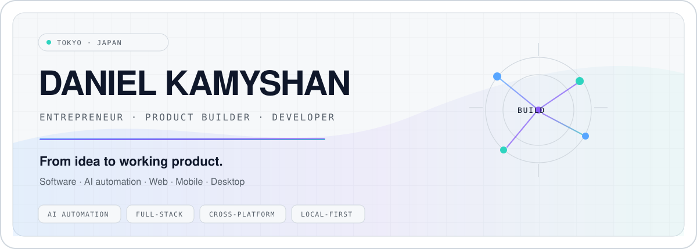

<picture>
  <source media="(prefers-color-scheme: dark)" srcset="./assets/hero-dark.svg">
  <source media="(prefers-color-scheme: light)" srcset="./assets/hero-light.svg">
  
</picture>

  <a href="#01--selected-work"><strong>Work</strong></a>
  &nbsp;·&nbsp;
  <a href="#02--open-source-contributions"><strong>Open source</strong></a>
  &nbsp;·&nbsp;
  <a href="#04--engineering-focus"><strong>Capabilities</strong></a>
  &nbsp;·&nbsp;
  <a href="#05--engineering-pulse"><strong>Activity</strong></a>
  &nbsp;·&nbsp;
  <a href="https://danielviktorovich.com/en/"><strong>Personal site ↗</strong></a>

## I build software that moves ideas into working products.

I'm **Daniel Kamyshan** — an entrepreneur, independent product builder and developer based in Tokyo.

I work across **AI automation, full-stack products, web, mobile and desktop software, internal tools, integrations and local-first applications**. I like taking ambiguous problems, turning them into a practical product shape, and shipping something people can actually use.

> **Available for selected freelance and contract work, product collaborations, and interesting engineering opportunities.**

### What I can build

**AI & automation** — AI-powered workflows, LLM integrations, agents, business automation and internal tools.

**Web & product** — landing pages, business websites, dashboards, MVPs, SaaS prototypes and full-stack applications.

**Applications & systems** — responsive/mobile interfaces, cross-platform app development, desktop software, APIs, integrations, local-first products and developer tools.

The goal is not technology for its own sake. I care about **the business outcome, the user experience, maintainability, and getting from prototype to a dependable product**.

<strong>Explore by goal — what could we build?</strong>

 

**“I need to automate a process.”**  
I can help connect APIs, internal systems and LLM tooling into a workflow that removes repetitive work instead of adding another dashboard nobody wants to maintain.

**“I need an MVP or product prototype.”**  
I can take a rough product idea through interface, backend, integration and deployment decisions to a working vertical slice you can test with real users.

**“I need a web, mobile or desktop application.”**  
I work across web interfaces and cross-platform application architectures, with an emphasis on reusable product logic and pragmatic delivery.

**“I have an existing system with an annoying technical problem.”**  
Debugging, integration work and focused upstream fixes are part of how I work too — see the open-source examples below.

---

## 01 / Selected work

### [RimLoc](https://github.com/0-danielviktorovich-0/RimLoc) — cross-platform localization tooling

A Rust-based toolkit for **RimWorld localization and mod translation management**, combining a production-oriented CLI with a desktop application.

`Rust` · `Tauri` · `CLI` · `Cross-platform` · `Open source`

- Discovers and validates localization data across real-world mod layouts.
- Supports translation workflows including PO/CSV interchange and QA checks.
- Shares one Rust core between CLI and desktop product surfaces.
- Public documentation, CI, tests and a published [`rimloc-cli`](https://crates.io/crates/rimloc-cli) crate.

**Status:** public and actively developed.

### BookKeeper — local-first personal finance product

A privacy-oriented personal finance application built around **user-owned data, local-first operation and a cross-platform product architecture**.

`Product engineering` · `Local-first` · `Cross-platform` · `Private development`

**Status:** in private development. I mention it here as current product work rather than presenting it as a public release.

---

## 02 / Open-source contributions

I also contribute fixes and features upstream when a problem is better solved in the project where it belongs.

### [RimSort #2448](https://github.com/RimSort/RimSort/pull/2448) — non-Steam installation discovery

Contributed a merged cross-platform feature for discovering RimWorld installations from **GOG, Heroic and non-Steam layouts**, with bounded filesystem search, content validation, safety constraints and regression coverage.

**Merged upstream** · Cross-platform product behavior · Python · Testing

### [anylinuxfs #149](https://github.com/nohajc/anylinuxfs/pull/149) — safer macOS hot-unplug behavior

Diagnosed a real external-media failure path and contributed a merged NFS mount fix that bounds retries when removable Linux filesystems disappear unexpectedly on macOS.

**Merged upstream** · Rust · macOS · Systems debugging

---

## 03 / How I work

**01 · Start with the outcome**  
Clarify the user, business goal, constraints and what “done” actually means before adding complexity.

**02 · Build a working vertical slice**  
Prefer something testable end-to-end over a large pile of disconnected scaffolding.

**03 · Verify the edges**  
Tests, CI, real data, failure states, diagnostics and cross-platform behavior matter as much as the happy path.

**04 · Treat software as a product**  
UX, documentation, deployment, observability and maintainability are part of engineering — not cleanup work for later.

---

## 04 / Engineering focus

**Product engineering**  
MVPs · SaaS · landing pages · dashboards · full-stack applications · product prototyping

**AI & automation**  
LLM integrations · AI workflows · agents · business automation · internal tooling · tool orchestration

**Applications**  
Web · responsive/mobile interfaces · cross-platform app development · desktop applications · local-first systems

**Systems & integrations**  
REST APIs · backend services · PostgreSQL · third-party integrations · developer tooling · CI/CD

<strong>Tools I reach for</strong>

 

| Area | Toolkit |
| --- | --- |
| Core | Rust · TypeScript / JavaScript · Python |
| Frontend | React · HTML · CSS · responsive UI |
| Desktop / cross-platform | Tauri · web technologies · native integrations |
| Backend | Rust services · Axum · REST APIs · PostgreSQL |
| AI | LLM APIs · agent/tool workflows · MCP-style integrations · automation |
| Platforms | macOS · Linux · Web · cross-platform delivery |

I choose the stack for the product rather than forcing every project into the same toolchain.

---

## 05 / GitHub activity & engineering signals

These cards are **live** — they are generated from GitHub data and update as the account changes.

### Contribution overview

<picture>
  <source media="(prefers-color-scheme: dark)" srcset="https://github-profile-summary-cards.vercel.app/api/cards/profile-details?username=0-danielviktorovich-0&theme=github_dark">
  <source media="(prefers-color-scheme: light)" srcset="https://github-profile-summary-cards.vercel.app/api/cards/profile-details?username=0-danielviktorovich-0&theme=github">
  
</picture>

### Work patterns

  <picture>
    <source media="(prefers-color-scheme: dark)" srcset="https://github-profile-summary-cards.vercel.app/api/cards/stats?username=0-danielviktorovich-0&theme=github_dark&hide_logo=true">
    <source media="(prefers-color-scheme: light)" srcset="https://github-profile-summary-cards.vercel.app/api/cards/stats?username=0-danielviktorovich-0&theme=github&hide_logo=true">
    
  </picture>
  <picture>
    <source media="(prefers-color-scheme: dark)" srcset="https://github-profile-summary-cards.vercel.app/api/cards/productive-time?username=0-danielviktorovich-0&theme=github_dark&utcOffset=9">
    <source media="(prefers-color-scheme: light)" srcset="https://github-profile-summary-cards.vercel.app/api/cards/productive-time?username=0-danielviktorovich-0&theme=github&utcOffset=9">
    
  </picture>

### Languages

  <picture>
    <source media="(prefers-color-scheme: dark)" srcset="https://github-profile-summary-cards.vercel.app/api/cards/repos-per-language?username=0-danielviktorovich-0&theme=github_dark">
    <source media="(prefers-color-scheme: light)" srcset="https://github-profile-summary-cards.vercel.app/api/cards/repos-per-language?username=0-danielviktorovich-0&theme=github">
    
  </picture>
  <picture>
    <source media="(prefers-color-scheme: dark)" srcset="https://github-profile-summary-cards.vercel.app/api/cards/most-commit-language?username=0-danielviktorovich-0&theme=github_dark">
    <source media="(prefers-color-scheme: light)" srcset="https://github-profile-summary-cards.vercel.app/api/cards/most-commit-language?username=0-danielviktorovich-0&theme=github">
    
  </picture>

### Contribution streak

  <picture>
    <source media="(prefers-color-scheme: dark)" srcset="https://streak-stats.demolab.com?user=0-danielviktorovich-0&theme=github-dark-blue&hide_border=true&mode=daily&card_width=900">
    <source media="(prefers-color-scheme: light)" srcset="https://streak-stats.demolab.com?user=0-danielviktorovich-0&theme=default&hide_border=true&mode=daily&card_width=900">
    
  </picture>

### Recent activity

<picture>
  <source media="(prefers-color-scheme: dark)" srcset="https://github-readme-activity-graph.vercel.app/graph?username=0-danielviktorovich-0&bg_color=0d1117&color=8b949e&line=8b5cf6&point=2dd4bf&area=true&hide_border=true&custom_title=Recent%20GitHub%20activity">
  <source media="(prefers-color-scheme: light)" srcset="https://github-readme-activity-graph.vercel.app/graph?username=0-danielviktorovich-0&bg_color=ffffff&color=57606a&line=8250df&point=0f766e&area=true&hide_border=true&custom_title=Recent%20GitHub%20activity">
  
</picture>

<strong>What is live here?</strong>

 

- **Contribution overview** — contribution history and headline GitHub activity.
- **Stats** — automatically derived commit / PR / issue / star signals.
- **Productive time** — contribution timing converted to **JST (UTC+9)**.
- **Languages** — repository-language and commit-language distributions.
- **Streak** — total contributions plus current and longest contribution streaks.
- **Recent activity** — current public GitHub activity over time.

The hosted cards currently reflect **public GitHub-visible data**. In the final profile repository, these can be moved to repository-owned GitHub Actions and optionally include private contribution counts without exposing private repository names.

---

## 06 / Current focus

- Shipping **RimLoc** as a stronger cross-platform product.
- Building **BookKeeper** in private development.
- Creating practical **AI automation, full-stack products and internal tools**.
- Taking on selected work where product thinking and engineering both matter.

---

## 07 / Have something worth building?

If you have a process that should be automated, a product that needs an MVP, a landing page that has to convert, an internal tool your team keeps postponing, or an application that needs to become real — I'm open to talking.

**Good fits:** freelance / contract builds · MVPs · AI automation · web products · mobile/cross-platform applications · desktop software · integrations · product collaborations · engineering roles

**[Personal site](https://danielviktorovich.com/en/)**

This GitHub is the engineering side of my work. For my broader background and other projects, see my personal site.

